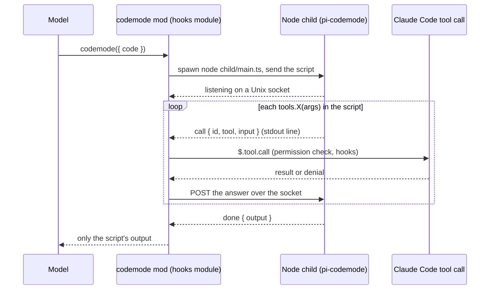
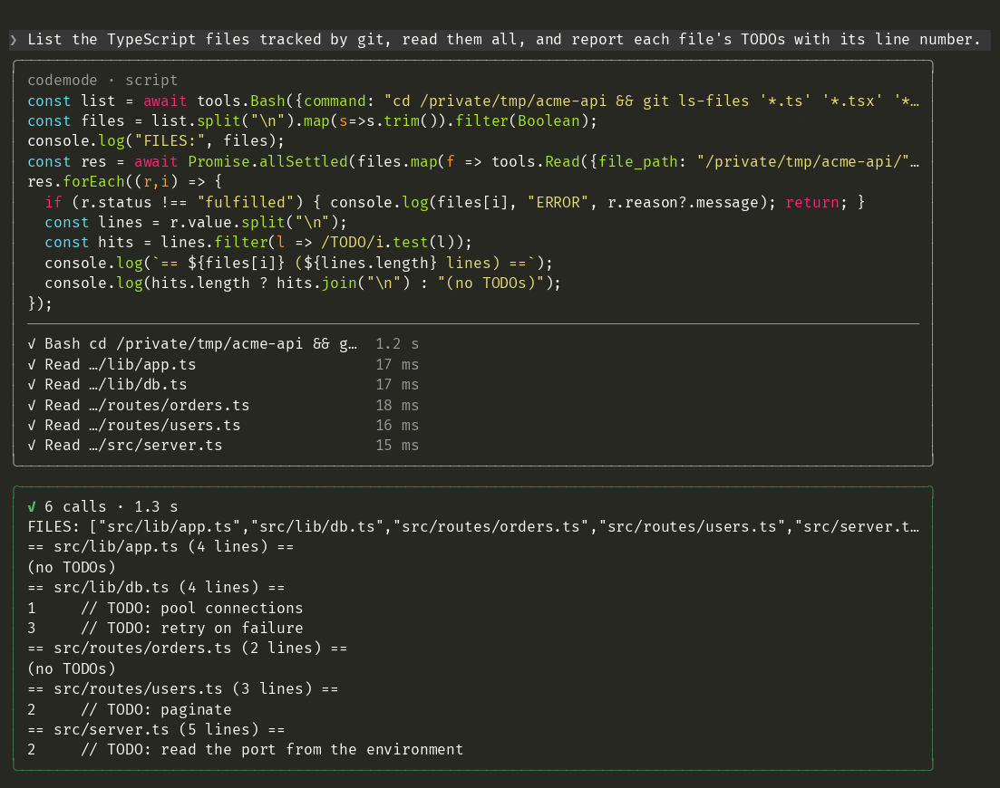

# codemode for Claude Code: a bridge to Pi's code mode

**Code mode for Claude Code:** one tool that lets the model write a JavaScript script that calls the session's own tools (`Read`, `Bash`, `Write`, `Edit`, and later MCP servers), and returns only the script's output. Many tool calls become one, and large intermediate results stay out of the context window.

**Inspired by [Pi's codemode](https://github.com/earendil-works/pi/blob/main/packages/coding-agent/docs/codemode.md)**, by Earendil. Earendil's post [**"You Said No MCP!"**](https://earendil.com/posts/you-said-no-mcp/) explains the idea and why it works. This project does not reimplement it. **It is a bridge:** it runs Pi's own script runtime, [`@earendil-works/pi-codemode`](https://github.com/earendil-works/pi/tree/main/packages/codemode) (QuickJS in WebAssembly), and connects each `tools.*` call the script makes to Claude Code's own tool call. Your permission rules, prompts and hooks still apply to every one of them, and a script written for Pi's codemode reads the same here.

> **Status: pilot (v0.1.0).** It exposes `Read`, `Bash`, `Write` and `Edit` for now. The design is in [ADR 0001](docs/adr/0001-a-claude-code-mod-hosts-the-pi-codemode-runtime-in-a-node-child-process-and-routes-every-nested-call-through-the-session-s-tool-call.md), which is still *Proposed*. The bridge overhead and the real token and turn savings are not measured yet.


*The prompt never mentions codemode. Claude writes one script that runs `git ls-files`, reads five files in parallel with `Promise.allSettled`, and keeps only the TODO lines. The nested calls are listed live as they run, and only the script's output returns to the model.*

## Why code mode

Calling tools one at a time costs a model turn per call, and every result, however large, lands in the context. In code mode the model writes a short program instead:

```js
const root = (await tools.Bash({ command: 'pwd' })).trim()
const files = (await tools.Bash({ command: 'git diff --name-only main' })).split('\n').filter(Boolean)
for (const file of files) {
  const source = await tools.Read({ file_path: `${root}/${file}` })
  if (source.includes('TODO')) text(file)
}
```

One tool call runs the whole loop, and only the matching file names come back.

The pattern is known as *code mode*: see [Cloudflare's Code Mode](https://blog.cloudflare.com/code-mode/) and [Anthropic's Code execution with MCP](https://www.anthropic.com/engineering/code-execution-with-mcp). This plugin makes it native to Claude Code.

## How it works



- **The tool:** the mod registers the tool, which the model sees as `mcp__codemode__codemode`.
- **Separate process:** a mod's hooks module has no WebAssembly and no `eval`. So each script runs in a short-lived Node child process that hosts `pi-codemode`, pinned to an exact version.
- **Permissions:** every nested call runs through `$.tool.call`, never `$.mcp.call`. Your allow and deny rules, permission prompts and `PreToolUse` hooks see each one.
- **Denials:** a denied or failed call throws an `Error` inside the script, and the script can catch it and continue.

## Requirements

- Claude Code with mods support (tested on 2.1.291; the mods API is early access).
- Node.js 22.19 or newer on your `PATH` (tested on Node 26).

## Install

From Claude Code:

```
/plugin install codemode --marketplace ejklock/claude-code-mode
```

Answer `y` to add the marketplace, then pick a scope.

> **Known gap:** the child needs `@earendil-works/pi-codemode`, and `node_modules` is not in the repository. After you install, run `npm ci` in the installed plugin's folder. A self-installing first run is planned.

To develop or try it from a clone:

```sh
git clone https://github.com/ejklock/claude-code-mode
cd claude-code-mode
npm ci
claude --plugin-dir .
```

## Use

Give Claude a task with many steps. Like Pi, the plugin keeps the tool declared up front, describes the script API to the model, and adds one line to the system prompt. With that, Claude picks codemode on its own when batching, chaining or filtering helps: in a measured run of a "read every file and report its TODOs" task, it chose codemode in 5 of 5 runs, against 0 of 5 without these hints ([issue 0004](docs/issues/0004-the-model-picks-codemode-on-its-own-because-the-tool-is-declared-up-front-described-like-pi-s-and-named-in-one-system-prompt-line.md)). For a single command, such as one `git grep`, it still calls `Bash` directly.

The transcript draws each call as two boxes. The first holds the highlighted script and its nested calls, each with its state and duration. The second holds a summary and the output:



In a script:

| API | What it does |
|---|---|
| `await tools.Read({ file_path, offset?, limit? })` | Resolves to the file's text. |
| `await tools.Bash({ command, timeout? })` | Resolves to the command's output. |
| `await tools.Write({ file_path, content })` | Writes the file; resolves to a confirmation. |
| `await tools.Edit({ file_path, old_string, new_string, replace_all? })` | Replaces text in the file; resolves to a confirmation. |
| `text(value)` / `console.log(value)` | Adds to the output that returns to the model. |

The script is the body of an async function, so top-level `await` works. `return` and `exit()` end the script; only what it prints with `text()` or `console.log()` comes back. Scripts time out after 120 seconds. Every `tools.*` call meets the session's permission mode and rules as a direct call does, so `Write` and `Edit` follow `acceptEdits`, allow rules and deny rules, and a refusal reaches the script as a rejection.

## Develop

```sh
npm ci
claude plugin validate .   # manifest and hooks module
claude plugin test .       # the mod's side, with a stand-in child
npm test                   # the real child on a real socket, and invariants
npm run typecheck
node scripts/e2e.ts        # headless end to end with claude -p (spends model tokens)
```

`npm test` and the end-to-end run open a Unix socket, so run them outside a sandbox that blocks socket `listen()`.

Decisions and open work live in [`docs/`](docs/index.md): the [constitution](docs/constitution.md), the ADRs, the issues and the research.

## Roadmap

- Measure the bridge overhead per nested call ([issue 0001](docs/issues/0001-a-prototype-runs-a-script-that-calls-read-and-bash-through-the-mod-and-measures-the-child-process-overhead.md)).
- Every built-in tool, the Agent tool and MCP servers as typed `tools.*`.
- `store()` / `load()`, tool search, and parity with Pi's lower-case names.
- Measure task-level token and turn savings, with and without codemode.

## Credits

- The idea and the script API come from [Pi's codemode](https://github.com/earendil-works/pi/blob/main/packages/coding-agent/docs/codemode.md) by Earendil. Read ["You Said No MCP!"](https://earendil.com/posts/you-said-no-mcp/) for the reasoning behind it.
- The script runtime is [`@earendil-works/pi-codemode`](https://github.com/earendil-works/pi/tree/main/packages/codemode) by Earendil Works, under the MIT license. This project only bridges it to Claude Code.

This project is not affiliated with Anthropic or Earendil.

## License

[MIT](LICENSE) © 2026 Evaldo Klock
