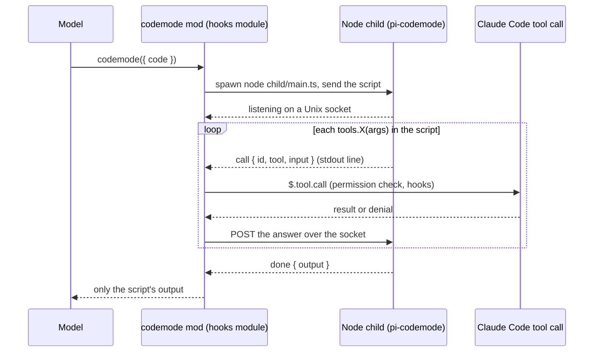

# codemode for Claude Code: a bridge to Pi's code mode

**Code mode for Claude Code:** one tool that lets the model write a JavaScript script that calls the session's own tools (`Read`, `Bash`, `Write`, `Edit`, the MCP resource tools, and the session's MCP tools), and returns only the script's output. Many tool calls become one, and large intermediate results stay out of the context window.

**Inspired by [Pi's codemode](https://github.com/earendil-works/pi/blob/main/packages/coding-agent/docs/codemode.md)**, by Earendil. Earendil's post [**"You Said No MCP!"**](https://earendil.com/posts/you-said-no-mcp/) explains the idea and why it works, and Armin Ronacher's [**"What is Codemode"**](https://lucumr.pocoo.org/2026/10/6/codemode/) describes it from the harness side. This project does not reimplement it. **It is a bridge:** it runs Pi's own script runtime, [`@earendil-works/pi-codemode`](https://github.com/earendil-works/pi/tree/main/packages/codemode) (QuickJS in WebAssembly), and connects each `tools.*` call the script makes to Claude Code's own tool call. Your permission rules, prompts and hooks still apply to every one of them, and a script written for Pi's codemode reads the same here.

> **Status: pilot (v0.6.0).** It exposes `Read`, `Bash`, `Write`, `Edit`, the three MCP resource tools, and every MCP tool connected in the session. The design is in [ADR 0001](docs/adr/0001-a-claude-code-mod-hosts-the-pi-codemode-runtime-in-a-node-child-process-and-routes-every-nested-call-through-the-session-s-tool-call.md), which is still *Proposed*. The bridge overhead and the task-level savings are measured — see [Benchmarks](#benchmarks) and [issue 0005](docs/issues/0005-benchmarks-show-the-bridge-overhead-and-the-token-turn-and-time-savings-of-codemode-per-task.md).


*The prompt never mentions codemode. Claude writes one script that runs `git ls-files`, reads five files in parallel with `Promise.allSettled`, and keeps only the TODO lines. The nested calls are listed live as they run, and only the script's output returns to the model.*

## What it is and where it shines

**What it is:** one tool, `codemode`. The model sends a short JavaScript script. The script runs in a sandbox and calls the session's tools as `tools.Read(...)`, `tools.Bash(...)`, `tools.Write(...)`, `tools.Edit(...)`, the MCP resource tools (`tools.ListMcpResourcesTool(...)`, `tools.ReadMcpResourceTool(...)`, `tools.ReadMcpResourceDirTool(...)`) and `tools.mcp__server__tool(...)`. Only what the script prints returns to the model. Every nested call still meets your permission rules, prompts and hooks.

**What it is for:** work that takes many tool calls, where each call needs a model turn and each result fills the context.

**Where it shines:**
- **Batching:** read or search many files at once with `Promise.allSettled`, instead of one call per file.
- **Filtering:** keep the matching lines and drop the rest, so a large result never reaches the context window.
- **Chaining:** use the result of one call as the input of the next, such as a `git` listing followed by a read of each file, in one turn.
- **MCP tools:** call several tools of a server, or of different servers, from one script.

**Where it does not:** a single command, such as one `git grep`. Claude still calls `Bash` directly, which is the right choice.

### Benchmarks

Measured with no model in the loop ([`node scripts/overhead.ts`](scripts/overhead.ts), 15 runs per size): the bridge costs **~98 ms to open** (child start, sandbox, socket, close) and **~0.1–0.3 ms per nested call** — 100 sequential calls add ~3 ms, within run-to-run noise. The bridge is expensive to open and nearly free to use.

The same tasks, with and without the plugin ([`node scripts/savings.ts`](scripts/savings.ts), 2026-10-06, Claude Code 2.1.292, claude-opus-5-5, 3 runs per side after one discarded warm-up, medians over all-correct runs, the prompt never naming codemode):

| Task | Turns with / without | Cache-read tokens with / without | Output tokens with / without | Cost with / without |
|---|---|---|---|---|
| read 5 tracked files, report their TODOs | 2 / 7 | 38,188 / 54,286 | 574 / 966 | $0.023 / $0.039 |
| `git log` → read each changed file | 2 / 4 | 38,222 / 55,041 | 443 / 414 | $0.021 / $0.024 |
| write 3 files | 6 / 8 | 111,935 / 93,581 | 1,229 / 1,321 | $0.062 / $0.059 |
| one `git grep` | 2 / 2 | 38,329 / 32,780 | 164 / 259 | $0.011 / $0.029 |

Why turns matter more than output tokens: every turn sends the whole context to the model again. With the prompt cache, that reread is billed as cache-read tokens, not as input, which is why the input column is near zero and the cache-read column carries the reread. Fewer turns mean fewer rereads, and the nested results a script handles never enter the context, so the turns that remain are smaller too.

Where many reads batch into one script, codemode cut the turns to less than a third, the cache-read tokens by ~30%, the output tokens to ~60% and the cost to ~60%, and the wall time fell with the turns (7.7 s against 11.9 s). On the write task the turns fell a quarter, but the cache reads rose (likely because the tool's schema and the script's confirmation output ride every remaining turn), so tokens and cost were level. On the single `git grep` — where codemode should not help — the model never used it (0 of 3 runs) and called `Bash` directly; that row's differences are run-to-run noise, not a saving or a cost of the tool. Input tokens are near zero on both sides because the context rides the prompt cache; the codemode tool's own schema (~430 tokens) is inside the with-side numbers. Ranges, method and the honest caveats are in [issue 0005](docs/issues/0005-benchmarks-show-the-bridge-overhead-and-the-token-turn-and-time-savings-of-codemode-per-task.md); with 3 runs per side, only the large differences above are claimed.

When a script fails, the result also lists the nested calls that already ran (`#<id> <tool> <args> — <state>: <detail>`), so a retry redoes only what did not. A call that threw, or never answered, is marked `unknown` rather than `failed`: it may have taken effect, so check before redoing it. In headless checks ([`node scripts/partial.ts`](scripts/partial.ts), 3 runs, a store whose create tool fails once, and with `--task ambiguous` one whose fourth create is stored but never answered) the model duplicated no write, before or after the change, so no saving is claimed; see [issue 0006](docs/issues/0006-a-failed-codemode-script-reports-which-nested-calls-already-ran-so-a-retry-does-not-repeat-side-effects.md).

**Read more:** Earendil's [Pi codemode](https://github.com/earendil-works/pi/blob/main/packages/coding-agent/docs/codemode.md) and ["You Said No MCP!"](https://earendil.com/posts/you-said-no-mcp/); Armin Ronacher's ["What is Codemode"](https://lucumr.pocoo.org/2026/10/6/codemode/); [Cloudflare's Code Mode](https://blog.cloudflare.com/code-mode/); [Anthropic's Code execution with MCP](https://www.anthropic.com/engineering/code-execution-with-mcp).

## Why code mode

Calling tools one at a time costs a model turn per call, and every result, however large, lands in the context. In code mode the model writes a short program instead:

```js
const root = (await tools.Bash({ command: 'pwd' })).trim()
const files = (await tools.Bash({ command: 'git diff --name-only main' })).split('\n').filter(Boolean)
for (const file of files) {
  const source = await tools.Read({ file_path: `${root}/${file}` })
  if (source.includes('TODO')) text(file)
}
```

One tool call runs the whole loop, and only the matching file names come back.

The pattern is known as *code mode*: see [Cloudflare's Code Mode](https://blog.cloudflare.com/code-mode/) and [Anthropic's Code execution with MCP](https://www.anthropic.com/engineering/code-execution-with-mcp). This plugin makes it native to Claude Code.

## How it works



- **The tool:** the mod registers the tool, which the model sees as `mcp__codemode__codemode`.
- **Separate process:** a mod's hooks module has no WebAssembly and no `eval`. So each script runs in a short-lived Node child process that hosts `pi-codemode`, pinned to an exact version.
- **Permissions:** every nested call runs through `$.tool.call`, never `$.mcp.call`. Your allow and deny rules, permission prompts and `PreToolUse` hooks see each one.
- **Denials:** a denied or failed call throws an `Error` inside the script, and the script can catch it and continue.

## Requirements

- Claude Code with mods support (tested on 2.1.291 and 2.1.292; the mods API is early access).
- Node.js 22.19 or newer on your `PATH` (tested on Node 26).

## Install

Run one command:

```sh
curl -fsSL https://raw.githubusercontent.com/ejklock/claude-code-mode/main/install.sh | sh
```

The script adds the marketplace, installs the plugin, and installs its dependency. It is safe to run again; a second run updates the plugin.

To choose where the plugin is installed, set `SCOPE` to `user` (the default), `project` or `local`:

```sh
curl -fsSL https://raw.githubusercontent.com/ejklock/claude-code-mode/main/install.sh | SCOPE=project sh
```

If you prefer not to pipe a script, install by hand. From Claude Code:

```
/plugin install codemode --marketplace ejklock/claude-code-mode
```

Answer `y` to add the marketplace, then pick a scope.

> **Known gap:** the child needs `@earendil-works/pi-codemode`, and `node_modules` is not in the repository. For the manual route, run `npm ci --omit=dev` in the installed plugin's folder after you install. The install script does this for you.

To develop or try it from a clone:

```sh
git clone https://github.com/ejklock/claude-code-mode
cd claude-code-mode
npm ci
claude --plugin-dir .
```

## Use

Give Claude a task with many steps. Like Pi, the plugin keeps the tool declared up front, describes the script API to the model, and adds one line to the system prompt. With that, Claude picks codemode on its own when batching, chaining or filtering helps: in a measured run of a "read every file and report its TODOs" task, it chose codemode in 5 of 5 runs, against 0 of 5 without these hints ([issue 0004](docs/issues/0004-the-model-picks-codemode-on-its-own-because-the-tool-is-declared-up-front-described-like-pi-s-and-named-in-one-system-prompt-line.md)). For a single command, such as one `git grep`, it still calls `Bash` directly.

The transcript draws each call as two boxes. The first holds the highlighted script and its nested calls, each with its state and duration. The second holds a summary and the output:


In a script:

| API | What it does |
|---|---|
| `await tools.Read({ file_path, offset?, limit? })` | Resolves to the file's text. |
| `await tools.Bash({ command, timeout? })` | Resolves to the command's output. |
| `await tools.Write({ file_path, content })` | Writes the file; resolves to a confirmation. |
| `await tools.Edit({ file_path, old_string, new_string, replace_all? })` | Replaces text in the file; resolves to a confirmation. |
| `await tools.ListMcpResourcesTool({ server? })` | Lists the resources MCP servers offer; resolves to the list. |
| `await tools.ReadMcpResourceTool({ server, uri })` | Reads an MCP resource; resolves to its text. |
| `await tools.ReadMcpResourceDirTool({ server, uri })` | Lists the resources under an MCP resource directory; resolves to the list. |
| `await tools.mcp__server__tool(args)` / `await tools["mcp__server__tool"](args)` | Calls a connected MCP tool by its full name; resolves to its text. A tool that is not connected is absent, and `ALL_TOOLS` lists those that are. |
| `text(value)` / `console.log(value)` | Adds to the output that returns to the model. |

The script is the body of an async function, so top-level `await` works. `return` and `exit()` end the script; only what it prints with `text()` or `console.log()` comes back. Scripts time out after 120 seconds. Every `tools.*` call meets the session's permission mode and rules as a direct call does, so `Write` and `Edit` follow `acceptEdits`, allow rules and deny rules, and a refusal reaches the script as a rejection.

### MCP exposure modes

Each MCP server, or each of its tools, takes one of Pi's four exposure modes. The modes set what the model sees and what a script can do:

| Mode | What the model sees | In a script |
|---|---|---|
| `codemode` | The tool is not declared up front. Its description tells the model to use it only through the codemode tool, and the codemode description lists it. | Callable. |
| `deferred` | The tool is not declared until tool search loads it. | Callable. |
| `direct` | The tool is declared with its full schema every turn, like a built-in tool. | Callable. |
| `hidden` | Nothing. A direct call is refused. | Refused, and left out of `ALL_TOOLS`. |

A server named in no list keeps Claude Code's own placement and stays callable from scripts. Installing the plugin changes no server until you name it. This differs from Pi, where the default is `codemode`.

Four settings hold the entries, one list for each mode: `mcpCodemode`, `mcpDeferred`, `mcpDirect` and `mcpHidden`. An entry is a server name (`codegraph`), one tool (`claude_ai_Gmail__trash_message`), or a server and a tool pattern, where `*` matches any characters (`claude_ai_Gmail__trash_*`). Write the name without the `mcp__` prefix.

`/plugin configure codemode` draws each setting as one text line and stores what you type as one comma-separated string, such as `codegraph, claude_ai_Gmail`. To set them by hand, put the lists in `settings.json`, under the plugin's name:

```json
{
  "pluginConfigs": {
    "codemode": {
      "options": {
        "mcpCodemode": ["claude_ai_Gmail", "codegraph"],
        "mcpHidden": ["claude_ai_Gmail__trash_*"]
      }
    }
  }
}
```

When more than one entry matches a tool, an exact tool name wins over a pattern, and a pattern wins over a server name. When two patterns match, the lists are read in the order `mcpHidden`, `mcpCodemode`, `mcpDeferred`, `mcpDirect`, and the first match wins. The same entry in two lists, or twice in one, fails the load with a message that names it. In the example, every Gmail tool is in `codemode` mode except the `trash_*` tools, which are hidden.

Limits:

- `deferred` takes effect only for a tool the engine is willing to defer. With `ENABLE_TOOL_SEARCH=auto`, the engine can keep a tool's schema in the request, and the model can call it directly.
- A direct call to a `codemode` tool still runs, as in Pi. The mode keeps the model from seeing the tool; it does not refuse the call.
- A `hidden` tool is refused for the model and missing from scripts.
- A `codemode` tool stays in the codemode description, unlike Pi, because scripts here have no `searchTools()` or `describeTool()`.

The measurements, including the adoption runs and the subagent view, are in [issue 0011](docs/issues/0011-each-mcp-server-takes-one-of-pi-s-four-exposure-modes-from-the-plugin-settings-and-an-unset-server-keeps-claude-code-s-default.md).

## Develop

```sh
npm ci
claude plugin validate .   # manifest and hooks module
claude plugin test .       # the mod's side, with a stand-in child
npm test                   # the real child on a real socket, and invariants
npm run typecheck
node scripts/e2e.ts        # headless end to end with claude -p (spends model tokens)
sh scripts/install-check.sh # runs install.sh for real into a throwaway config (slow)
node scripts/partial.ts --runs 3  # duplicated writes after a failed script, headless (spends model tokens)
```

`npm test` and the end-to-end run open a Unix socket, so run them outside a sandbox that blocks socket `listen()`.

Decisions and open work live in [`docs/`](docs/index.md): the [constitution](docs/constitution.md), the ADRs, the issues and the research.

## Roadmap

- Every built-in tool and the Agent tool as typed `tools.*`.
- `store()` / `load()`, tool search, and parity with Pi's lower-case names.
- Re-measure the task savings at five or more runs per side once the rate window allows ([issue 0005](docs/issues/0005-benchmarks-show-the-bridge-overhead-and-the-token-turn-and-time-savings-of-codemode-per-task.md)).

## Credits

- The idea and the script API come from [Pi's codemode](https://github.com/earendil-works/pi/blob/main/packages/coding-agent/docs/codemode.md) by Earendil. Read ["You Said No MCP!"](https://earendil.com/posts/you-said-no-mcp/) for the reasoning behind it, and Armin Ronacher's ["What is Codemode"](https://lucumr.pocoo.org/2026/10/6/codemode/) for what it adds beyond CLI-based tools.
- The script runtime is [`@earendil-works/pi-codemode`](https://github.com/earendil-works/pi/tree/main/packages/codemode) by Earendil Works, under the MIT license. This project only bridges it to Claude Code.

This project is not affiliated with Anthropic or Earendil.

## License

[MIT](LICENSE) © 2026 Evaldo Klock
