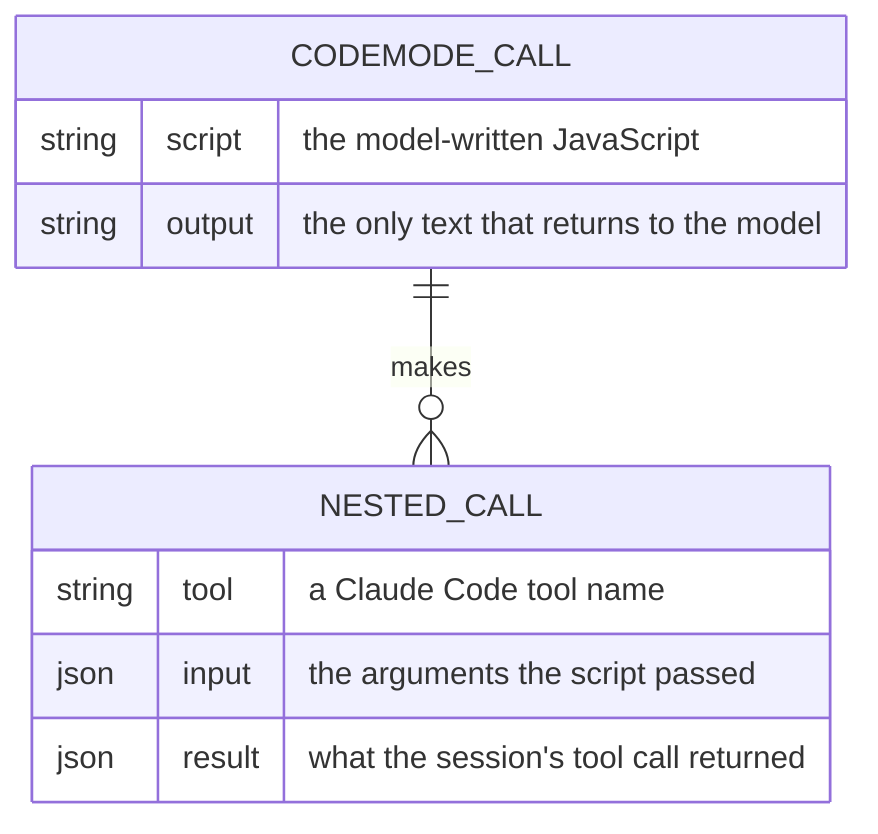

# claude-code-mode Constitution

## Product

claude-code-mode is a Claude Code mod that gives the model one `codemode` tool: the model writes a JavaScript script that calls the session's tools, and only the script's output returns to the model. It serves the owner's Claude Code sessions, with the same script API as Pi's codemode so one procedure runs the same in both harnesses.

## Scope Boundaries

**In scope:**

- One `codemode` tool registered by a Claude Code mod.
- Script calls to Claude Code's built-in tools, the Agent tool and the session's MCP servers, exposed as typed `tools.*` functions.
- The script runtime from `@earendil-works/pi-codemode`, run outside the mod's own environment.
- Measuring the cost and the saving in tokens and turns.

**Explicitly out of scope:**

- The Pi harness itself, or any Pi package other than `@earendil-works/pi-codemode`.
- A runtime of our own that copies Pi's API.
- A tool that reaches the file system, the shell or the network except through the session's tools.
- Harnesses other than Claude Code.

**Phase boundaries:**

- Phase 1: the pilot. `tools.Read` and `tools.Bash` through the bridge, with the overhead measured.
- Phase 2: every built-in tool, the Agent tool and MCP servers as typed tools, then `store()`/`load()`, tool search, and the task-level measurement.

## Data Model / Schema Foundation

One `codemode` call runs one script and makes zero or more nested calls. Each nested call is one session tool call with its own permission check. A nested call made before a script fails is not undone.

## Non-negotiables

- Every nested call runs through the session's tool call (`$.tool.call`), so the permission check and the hooks apply; no source file calls `$.mcp.call`.
- `@earendil-works/pi-codemode` is pinned to an exact version, with no version range.
- The script reaches the file system, the shell and the network only through nested tool calls.
- All artifacts (code, comments, docs) are in English.
- Diagrams are Mermaid.

## Amendment Log

Amendments are appended here as `## Amendment N — YYYY-MM-DD: summary`; the sections above are not edited once ratified.
